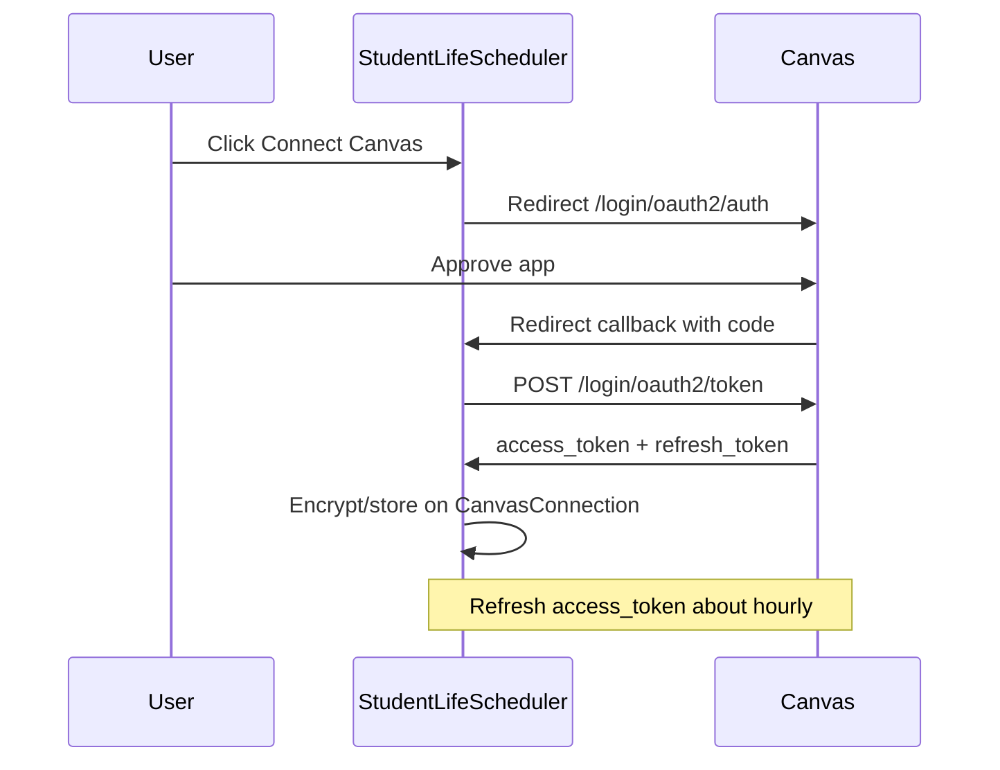

# Canvas OAuth integration (deferred)

Status: **blocked on Canvas admin Developer Key**  
Resume after: institution enables an API Developer Key for this app.

## Why OAuth (not PAT)

Canvas supports OAuth2 for third-party apps and requires it for multi-user use. Asking users to paste personal access tokens violates Canvas API policy, and many schools disable student PAT creation.

OAuth still needs admin involvement once: create/enable a **Developer Key** (client id + secret). That is different from approving per-user PATs.

| Approach | Admin controls | User experience |
|---|---|---|
| PAT (current) | Often disables user token creation | Paste long-lived token in Settings |
| OAuth (planned) | One Developer Key for the app | “Connect Canvas” consent screen |

## Current code (keep until OAuth lands)

- Settings UI: `src/app/settings/canvas/page.tsx`
- Connect API: `src/app/api/canvas/connect/route.ts`
- Client + sync: `src/lib/canvas/client.ts`, `src/lib/canvas/sync.ts`
- Schema: `CanvasConnection` with `baseUrl` + `encryptedToken` in `prisma/schema.prisma`

OAuth reuses sync/client; only connection + token lifecycle change.

## Admin request template

Send something like this to your Canvas / academic tech admins:

> Hi — I’m building **Student Life Scheduler**, a student scheduling app that syncs courses, assignments, calendar events, and grades from Canvas via the REST API.
>
> Canvas policy requires OAuth (not personal access tokens) for multi-user apps. Please create and enable a **Canvas API Developer Key** for:
>
> - **App name:** Student Life Scheduler  
> - **Redirect URIs:**  
>   - `http://localhost:3000/api/canvas/oauth/callback`  
>   - `<production-url>/api/canvas/oauth/callback`  
> - **Requested scopes** (read): courses, assignments, calendar events, enrollments / grades  
> - **Key type:** standard API Developer Key (not LTI)
>
> Please send the **client id**, **client secret**, and confirm the Canvas base URL (e.g. `https://canvas.colorado.edu`).

Update redirect URIs and base URL before sending.

## Implementation checklist (when unblocked)

1. **Env vars**
   - `CANVAS_BASE_URL`
   - `CANVAS_CLIENT_ID`
   - `CANVAS_CLIENT_SECRET`
   - `CANVAS_REDIRECT_URI` (or derive from app URL)

2. **Schema** — extend `CanvasConnection`:
   - `encryptedAccessToken`
   - `encryptedRefreshToken`
   - `accessTokenExpiresAt`
   - keep `baseUrl`
   - optional temporary `authMethod` (`oauth` | `pat`) for local fallback

3. **Routes**
   - `GET /api/canvas/oauth/start` — create `state`, redirect to `/login/oauth2/auth`
   - `GET /api/canvas/oauth/callback` — exchange `code`, store encrypted tokens, redirect to Settings

4. **Token refresh** — in `getCanvasClient` (`src/lib/canvas/sync.ts`):
   - if access token expired/near expiry, refresh with refresh token + client secret
   - persist new access token / expiry
   - return existing `CanvasClient`

5. **Settings UX** — replace PAT form with “Connect with Canvas”; keep Sync / Disconnect

6. **Out of scope**
   - LTI 1.3 / Canvas embedding
   - Global Instructure developer keys (multi-school vendor path)

## Flow

## References

- [Canvas OAuth2](https://canvas.instructure.com/doc/api/file.oauth.html)
- [Developer Keys](https://canvas.instructure.com/doc/api/file.developer_keys.html)
